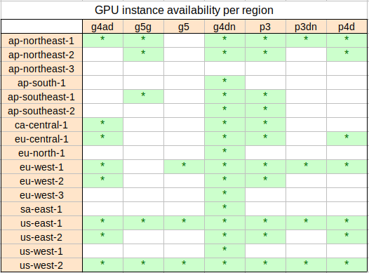

# AWS Crypto Miner

CloudFormation template for mining **Ravencoin (RVN)**, **Ergo (ERG)**, **Kaspa (KAS)**, and **Ethereum Classic (ETC)** altcoins on AWS GPU-enabled EC2 instances, with a support for payouts in **Bitcoin (BTC)**

## Important!

- Crypto mining on AWS is not always profitable. Do your own research!

- [Reach out to me](../../issues) if you need help with any customisation, e.g. to add support for other crypto currencies, etc.

## Quick start

1. Have your **BTC wallet address** ready for payouts (even if mining RVN, ERG, KAS, or ETC).
2. **Login** to your AWS account.
3. **Launch the stack** in one or more of the cheapest regions. Sometimes spot
   capacity is not available in a particular region, in that case try a different
   one.

You will have an opportunity to check the stack details, enter the wallet address, etc, before the stack is launched.

|Region|Default VPC|Custom VPC|
|------|-----------|----------|
|ap-northeast-1 **Tokyo**|[**Launch to Default VPC**](https://console.aws.amazon.com/cloudformation/home?region=ap-northeast-1#/stacks/new?stackName=miner&templateURL=https://s3.us-west-2.amazonaws.com/cnl4uehyq6/cryptominer/template-default-vpc.yml)|[_Launch to Custom VPC_](https://console.aws.amazon.com/cloudformation/home?region=ap-northeast-1#/stacks/new?stackName=miner&templateURL=https://s3.us-west-2.amazonaws.com/cnl4uehyq6/cryptominer/template-custom-vpc.yml)|
|ap-northeast-2 **Seoul**|[**Launch to Default VPC**](https://console.aws.amazon.com/cloudformation/home?region=ap-northeast-2#/stacks/new?stackName=miner&templateURL=https://s3.us-west-2.amazonaws.com/cnl4uehyq6/cryptominer/template-default-vpc.yml)|[_Launch to Custom VPC_](https://console.aws.amazon.com/cloudformation/home?region=ap-northeast-2#/stacks/new?stackName=miner&templateURL=https://s3.us-west-2.amazonaws.com/cnl4uehyq6/cryptominer/template-custom-vpc.yml)|
|ap-northeast-3 **Osaka**|[**Launch to Default VPC**](https://console.aws.amazon.com/cloudformation/home?region=ap-northeast-3#/stacks/new?stackName=miner&templateURL=https://s3.us-west-2.amazonaws.com/cnl4uehyq6/cryptominer/template-default-vpc.yml)|[_Launch to Custom VPC_](https://console.aws.amazon.com/cloudformation/home?region=ap-northeast-3#/stacks/new?stackName=miner&templateURL=https://s3.us-west-2.amazonaws.com/cnl4uehyq6/cryptominer/template-custom-vpc.yml)|
|ap-south-1 **Mumbai**|[**Launch to Default VPC**](https://console.aws.amazon.com/cloudformation/home?region=ap-south-1#/stacks/new?stackName=miner&templateURL=https://s3.us-west-2.amazonaws.com/cnl4uehyq6/cryptominer/template-default-vpc.yml)|[_Launch to Custom VPC_](https://console.aws.amazon.com/cloudformation/home?region=ap-south-1#/stacks/new?stackName=miner&templateURL=https://s3.us-west-2.amazonaws.com/cnl4uehyq6/cryptominer/template-custom-vpc.yml)|
|ap-southeast-1 **Singapore**|[**Launch to Default VPC**](https://console.aws.amazon.com/cloudformation/home?region=ap-southeast-1#/stacks/new?stackName=miner&templateURL=https://s3.us-west-2.amazonaws.com/cnl4uehyq6/cryptominer/template-default-vpc.yml)|[_Launch to Custom VPC_](https://console.aws.amazon.com/cloudformation/home?region=ap-southeast-1#/stacks/new?stackName=miner&templateURL=https://s3.us-west-2.amazonaws.com/cnl4uehyq6/cryptominer/template-custom-vpc.yml)|
|ap-southeast-2 **Sydney**|[**Launch to Default VPC**](https://console.aws.amazon.com/cloudformation/home?region=ap-southeast-2#/stacks/new?stackName=miner&templateURL=https://s3.us-west-2.amazonaws.com/cnl4uehyq6/cryptominer/template-default-vpc.yml)|[_Launch to Custom VPC_](https://console.aws.amazon.com/cloudformation/home?region=ap-southeast-2#/stacks/new?stackName=miner&templateURL=https://s3.us-west-2.amazonaws.com/cnl4uehyq6/cryptominer/template-custom-vpc.yml)|
|ca-central-1 **Central**|[**Launch to Default VPC**](https://console.aws.amazon.com/cloudformation/home?region=ca-central-1#/stacks/new?stackName=miner&templateURL=https://s3.us-west-2.amazonaws.com/cnl4uehyq6/cryptominer/template-default-vpc.yml)|[_Launch to Custom VPC_](https://console.aws.amazon.com/cloudformation/home?region=ca-central-1#/stacks/new?stackName=miner&templateURL=https://s3.us-west-2.amazonaws.com/cnl4uehyq6/cryptominer/template-custom-vpc.yml)|
|eu-central-1 **Frankfurt**|[**Launch to Default VPC**](https://console.aws.amazon.com/cloudformation/home?region=eu-central-1#/stacks/new?stackName=miner&templateURL=https://s3.us-west-2.amazonaws.com/cnl4uehyq6/cryptominer/template-default-vpc.yml)|[_Launch to Custom VPC_](https://console.aws.amazon.com/cloudformation/home?region=eu-central-1#/stacks/new?stackName=miner&templateURL=https://s3.us-west-2.amazonaws.com/cnl4uehyq6/cryptominer/template-custom-vpc.yml)|
|eu-north-1 **Stockholm**|[**Launch to Default VPC**](https://console.aws.amazon.com/cloudformation/home?region=eu-north-1#/stacks/new?stackName=miner&templateURL=https://s3.us-west-2.amazonaws.com/cnl4uehyq6/cryptominer/template-default-vpc.yml)|[_Launch to Custom VPC_](https://console.aws.amazon.com/cloudformation/home?region=eu-north-1#/stacks/new?stackName=miner&templateURL=https://s3.us-west-2.amazonaws.com/cnl4uehyq6/cryptominer/template-custom-vpc.yml)|
|eu-west-1 **Ireland**|[**Launch to Default VPC**](https://console.aws.amazon.com/cloudformation/home?region=eu-west-1#/stacks/new?stackName=miner&templateURL=https://s3.us-west-2.amazonaws.com/cnl4uehyq6/cryptominer/template-default-vpc.yml)|[_Launch to Custom VPC_](https://console.aws.amazon.com/cloudformation/home?region=eu-west-1#/stacks/new?stackName=miner&templateURL=https://s3.us-west-2.amazonaws.com/cnl4uehyq6/cryptominer/template-custom-vpc.yml)|
|eu-west-2 **London**|[**Launch to Default VPC**](https://console.aws.amazon.com/cloudformation/home?region=eu-west-2#/stacks/new?stackName=miner&templateURL=https://s3.us-west-2.amazonaws.com/cnl4uehyq6/cryptominer/template-default-vpc.yml)|[_Launch to Custom VPC_](https://console.aws.amazon.com/cloudformation/home?region=eu-west-2#/stacks/new?stackName=miner&templateURL=https://s3.us-west-2.amazonaws.com/cnl4uehyq6/cryptominer/template-custom-vpc.yml)|
|eu-west-3 **Paris**|[**Launch to Default VPC**](https://console.aws.amazon.com/cloudformation/home?region=eu-west-3#/stacks/new?stackName=miner&templateURL=https://s3.us-west-2.amazonaws.com/cnl4uehyq6/cryptominer/template-default-vpc.yml)|[_Launch to Custom VPC_](https://console.aws.amazon.com/cloudformation/home?region=eu-west-3#/stacks/new?stackName=miner&templateURL=https://s3.us-west-2.amazonaws.com/cnl4uehyq6/cryptominer/template-custom-vpc.yml)|
|sa-east-1 **São Paulo**|[**Launch to Default VPC**](https://console.aws.amazon.com/cloudformation/home?region=sa-east-1#/stacks/new?stackName=miner&templateURL=https://s3.us-west-2.amazonaws.com/cnl4uehyq6/cryptominer/template-default-vpc.yml)|[_Launch to Custom VPC_](https://console.aws.amazon.com/cloudformation/home?region=sa-east-1#/stacks/new?stackName=miner&templateURL=https://s3.us-west-2.amazonaws.com/cnl4uehyq6/cryptominer/template-custom-vpc.yml)|
|us-east-1 **N. Virginia**|[**Launch to Default VPC**](https://console.aws.amazon.com/cloudformation/home?region=us-east-1#/stacks/new?stackName=miner&templateURL=https://s3.us-west-2.amazonaws.com/cnl4uehyq6/cryptominer/template-default-vpc.yml)|[_Launch to Custom VPC_](https://console.aws.amazon.com/cloudformation/home?region=us-east-1#/stacks/new?stackName=miner&templateURL=https://s3.us-west-2.amazonaws.com/cnl4uehyq6/cryptominer/template-custom-vpc.yml)|
|us-east-2 **Ohio**|[**Launch to Default VPC**](https://console.aws.amazon.com/cloudformation/home?region=us-east-2#/stacks/new?stackName=miner&templateURL=https://s3.us-west-2.amazonaws.com/cnl4uehyq6/cryptominer/template-default-vpc.yml)|[_Launch to Custom VPC_](https://console.aws.amazon.com/cloudformation/home?region=us-east-2#/stacks/new?stackName=miner&templateURL=https://s3.us-west-2.amazonaws.com/cnl4uehyq6/cryptominer/template-custom-vpc.yml)|
|us-west-1 **N. California**|[**Launch to Default VPC**](https://console.aws.amazon.com/cloudformation/home?region=us-west-1#/stacks/new?stackName=miner&templateURL=https://s3.us-west-2.amazonaws.com/cnl4uehyq6/cryptominer/template-default-vpc.yml)|[_Launch to Custom VPC_](https://console.aws.amazon.com/cloudformation/home?region=us-west-1#/stacks/new?stackName=miner&templateURL=https://s3.us-west-2.amazonaws.com/cnl4uehyq6/cryptominer/template-custom-vpc.yml)|
|us-west-2 **Oregon**|[**Launch to Default VPC**](https://console.aws.amazon.com/cloudformation/home?region=us-west-2#/stacks/new?stackName=miner&templateURL=https://s3.us-west-2.amazonaws.com/cnl4uehyq6/cryptominer/template-default-vpc.yml)|[_Launch to Custom VPC_](https://console.aws.amazon.com/cloudformation/home?region=us-west-2#/stacks/new?stackName=miner&templateURL=https://s3.us-west-2.amazonaws.com/cnl4uehyq6/cryptominer/template-custom-vpc.yml)|

The following *Opt-in regions* must be enbled in [AWS Account settings](https://us-east-1.console.aws.amazon.com/billing/home#/account) before use...

|Region|Default VPC|Custom VPC|
|------|-----------|----------|
|af-south-1 **Cape Town**|[**Launch to Default VPC**](https://console.aws.amazon.com/cloudformation/home?region=af-south-1#/stacks/new?stackName=miner&templateURL=https://s3.us-west-2.amazonaws.com/cnl4uehyq6/cryptominer/template-default-vpc.yml)|[_Launch to Custom VPC_](https://console.aws.amazon.com/cloudformation/home?region=af-south-1#/stacks/new?stackName=miner&templateURL=https://s3.us-west-2.amazonaws.com/cnl4uehyq6/cryptominer/template-custom-vpc.yml)|
|ap-east-1 **Hong Kong**|[**Launch to Default VPC**](https://console.aws.amazon.com/cloudformation/home?region=ap-east-1#/stacks/new?stackName=miner&templateURL=https://s3.us-west-2.amazonaws.com/cnl4uehyq6/cryptominer/template-default-vpc.yml)|[_Launch to Custom VPC_](https://console.aws.amazon.com/cloudformation/home?region=ap-east-1#/stacks/new?stackName=miner&templateURL=https://s3.us-west-2.amazonaws.com/cnl4uehyq6/cryptominer/template-custom-vpc.yml)|
|eu-south-1 **Milan**|[**Launch to Default VPC**](https://console.aws.amazon.com/cloudformation/home?region=eu-south-1#/stacks/new?stackName=miner&templateURL=https://s3.us-west-2.amazonaws.com/cnl4uehyq6/cryptominer/template-default-vpc.yml)|[_Launch to Custom VPC_](https://console.aws.amazon.com/cloudformation/home?region=eu-south-1#/stacks/new?stackName=miner&templateURL=https://s3.us-west-2.amazonaws.com/cnl4uehyq6/cryptominer/template-custom-vpc.yml)|
|me-south-1 **Bahrain**|[**Launch to Default VPC**](https://console.aws.amazon.com/cloudformation/home?region=me-south-1#/stacks/new?stackName=miner&templateURL=https://s3.us-west-2.amazonaws.com/cnl4uehyq6/cryptominer/template-default-vpc.yml)|[_Launch to Custom VPC_](https://console.aws.amazon.com/cloudformation/home?region=me-south-1#/stacks/new?stackName=miner&templateURL=https://s3.us-west-2.amazonaws.com/cnl4uehyq6/cryptominer/template-custom-vpc.yml)|

### Which region should I use?

Not all instance types are available in all regions. Use the table below to
choose the region which supports your desired instance type.

Also note that the Spot and On-Demand prices differ between the regions. The US
regions are typically slightly cheaper but often have availability issues,
especially on Spot. The non-US regions are a little more expensive but may have
the desired instance types available more readily.

[](tools/instance-regions.png)

### What does the template do?

* Spins up an AutoScaling Group with *Spot Instances* of the specified instance types, with the most efficient attempted first (usually *g5.xlarge*, *g4dn.xlarge*, etc ...)
  * Use [template-default-vpc.yml](template-default-vpc.yml) if you want to spin up the instances in the _Default VPC_ (most users).
  * Use [template-custom-vpc.yml](template-custom-vpc.yml) if you have _your own VPC_ that you want to use (advanced users). 
    The Subnets must have direct or NAT access to the internet! Make sure that the VPC matches the Subnets selected!!
* Runs the miner program with the right options for mining with the _2miners_ pool upon the instance start.

### Increase resource quotas

All right you have created the stack but no instances seem to be running. If you navigate to *EC2* -> *Autoscaling groups* 
-> *miner* -> *Events* tab you may see this error:

> Failed: Launching a new EC2 instance.
> 
> Status Reason: **Max spot instance count exceeded.** Launching EC2 instance failed.

AWS accounts have default limits (quotas) on some resources. You may find, for example, that your quota for 
_All G and VT Spot Instance Requests_ in a particular region is *0* and you therefore can't start any `g4dn.xlarge` instances.
It pays to request the quotas increase which can be done with this simple command (you can do this from the CloudShell):

```
export AWS_REGION=us-west-2 # Oregon
export CODE=L-3819A6DF      # All G and VT Spot Instance Requests (for g5.xlarge, g4dn.xlarge, etc)
# export CODE=L-7212CCBC    # All P Spot Instance Requests (for p3.2xlarge, p3dn.24xlarge or p4d.24xlarge)
export VCPUS=96             # 96 vCPUs - can accommodate e.g. 24x g4dn.xlarge or 1x p4d.24xlarge

aws --region ${AWS_REGION} service-quotas request-service-quota-increase --service-code ec2 --quota-code ${CODE} --desired-value ${VCPUS}
```

Choose the number of *vCPU* and the *Quota code* according to your needs.

### Expand to Los Angeles (us-west-2-lax-1)

Spot instance capacity for `g4dn.xlarge` instances is in short supply in the cheapest regions, even though the spot 
prices are still very very low. You may have to wait for a long time to get an instance.

Interestingly the *Los Angeles local zone* seems to have plenty of g4dn spot capacity at the same price as Oregon, 
however you have to opt-in to be able to use it. Here is how (you can do this from the CloudShell):

1. **Opt-in to the LAX zone** with: 
    ```
    aws --region us-west-2 ec2 modify-availability-zone-group --group-name us-west-2-lax-1 --opt-in-status opted-in
    ```
2. Create new **default subnets** in the 2 LAX AZs in the default Oregon VPC:
    ```
    aws --region us-west-2 ec2 create-default-subnet --availability-zone us-west-2-lax-1a
    aws --region us-west-2 ec2 create-default-subnet --availability-zone us-west-2-lax-1b
    ```
3. **Delete and re-deploy** the CFN stack in **us-west-2 (Oregon)** - it will pick up the 2 new AZs and launch the instances.

## Tell me more ...

Check out the instructions in my [Medium article](https://michael-ludvig.medium.com/mining-ethereum-on-aws-is-it-worth-it-f13645c12eec),
it contains some important considerations. Alternatively, if you think you know what you are doing follow these instructions:

* Have your *BTC* wallet address ready. Best to use a non-custodial wallet like [Guarda](https://giarda.com) or [Electrum](https://electrum.org) or even better a hardware wallet like [Ledger](https://ledger.com) or [Trezor](https://trezor.io).
* Login to your [AWS account](https://aws.amazon.com).
* Click the [Launch link](https://console.aws.amazon.com/cloudformation/home?region=us-west-2#/stacks/new?stackName=miner&templateURL=https://s3.us-west-2.amazonaws.com/cnl4uehyq6/cryptominer/template-default-vpc.yml) or create the stack manually:
  * Download the [template-default-vpc.yml](template-default-vpc.yml) template (or [template-custom-vpc.yml](template-custom-vpc.yml), see above) or clone this Github repository.
  * In the AWS Console select one of the cheap regions (typically Oregon, N.Virginia, or Ohio)
  * Create a CloudFormation stack from the [template-default-vpc.yml](template-default-vpc.yml)
* Check your mining progress in [2miners dashboard](https://2miners.org/). 
  * Note that it takes some time (15 ~ 30 mins) before your stats start to appear, and 
  * The *reported* hashrate speed ramps up slowly to the sustained rate over the first hour or
    so, I believe due to delays in reporting and some averaging. 
* When done delete the stack.

## Author

[Michael Ludvig](https://michael-ludvig.medium.com), you're welcome :)
